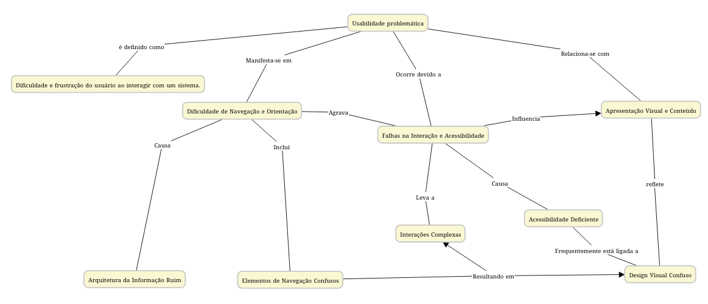

#  Objeto de Aprendizagem: Diagnóstico de Usabilidade Web

Este repositório contém um Objeto de Aprendizagem (OA) projetado para ensinar os princípios de **Usabilidade e Acessibilidade em Interfaces Web** através de uma abordagem prática de **diagnóstico de erros**.

---

## Visão Geral e Público-Alvo

O OA utiliza uma metodologia de **Aprendizagem Baseada em Erros**, onde o aluno interage com um site propositalmente problemático para identificar e justificar falhas.

| Característica | Detalhe |
| :--- | :--- |
| **Público-Alvo** | **Estudantes de Ciências da Computação**, **Iniciantes no Desenvolvimento Web**, Designers UX/UI. |
| **Requisito Atendido** | Capacidade de **avaliar e projetar** interfaces web usáveis e acessíveis. |
| **Conceitos Chave** | **Heurísticas de Usabilidade de Nielsen**, Acessibilidade (WCAG), Design de Interação. |

---

### Mapa Conceitual

### Máquina de Estados do OA

